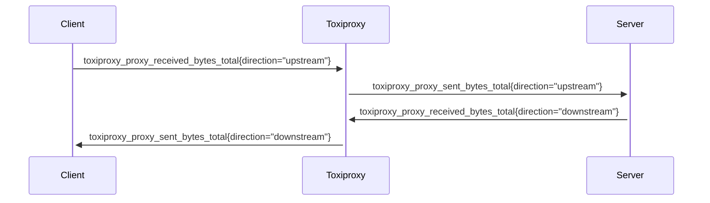

# Metrics

- [Metrics](#metrics)
    - [Runtime Metrics](#runtime-metrics)
    - [Proxy Metrics](#proxy-metrics)
      - [toxiproxy_proxy_connection_duration_seconds](#toxiproxy_proxy_connection_duration_seconds)
      - [toxiproxy_proxy_real_connection_duration_seconds](#toxiproxy_proxy_real_connection_duration_seconds)
      - [toxiproxy_proxy_received_bytes_total / toxiproxy_proxy_sent_bytes_total](#toxiproxy_proxy_received_bytes_total--toxiproxy_proxy_sent_bytes_total)

### Runtime Metrics

To enable runtime metrics related to the state of the go runtime, build version, process info, use the `-runtime-metrics` flag.

For more details, see below:
- [NewGoCollector](https://pkg.go.dev/github.com/prometheus/client_golang/prometheus/collectors#NewGoCollector)
- [NewBuildInfoCollector](https://pkg.go.dev/github.com/prometheus/client_golang/prometheus/collectors#NewBuildInfoCollector)
- [NewProcessCollector](https://pkg.go.dev/github.com/prometheus/client_golang/prometheus/collectors#NewProcessCollector)

### Proxy Metrics

To enable metrics related to toxiproxy internals, use the `-proxy-metrics` flag.

#### toxiproxy_proxy_connection_duration_seconds

A histogram metric that tracks the duration of proxy connections in seconds for each specific proxy.

**Type**

Histogram

**Labels**

| Label     | Description                    | Example               |
|-----------|--------------------------------|-----------------------|
| listener  | Listener address of this proxy | 0.0.0.0:8080          |
| proxy     | Proxy name                     | my-proxy              |
| upstream  | Upstream address of this proxy | httpbin.org:80        |

#### toxiproxy_proxy_real_connection_duration_seconds

A histogram metric that tracks the real duration of proxy connections in seconds, excluding artificial latency added by latency toxics. This metric represents the actual connection time without the delays introduced by toxiproxy latency toxics.

**Note**: This metric is recorded once per connection (when the downstream link finishes), accumulating artificial latency from both upstream and downstream directions.

**Type**

Histogram

**Labels**

| Label     | Description                    | Example               |
|-----------|--------------------------------|-----------------------|
| listener  | Listener address of this proxy | 0.0.0.0:8080          |
| proxy     | Proxy name                     | my-proxy              |
| upstream  | Upstream address of this proxy | httpbin.org:80        |

#### toxiproxy_proxy_received_bytes_total / toxiproxy_proxy_sent_bytes_total

The total number of bytes received/sent on a given proxy link in a given direction

**Type**

Counter

**Labels**

| Label     | Description                    | Example               |
|-----------|--------------------------------|-----------------------|
| direction | Direction of the link          | upstream / downstream |
| listener  | Listener address of this proxy | 0.0.0.0:8080          |
| proxy     | Proxy name                     | my-proxy              |
| upstream  | Upstream address of this proxy | httpbin.org:80        |

